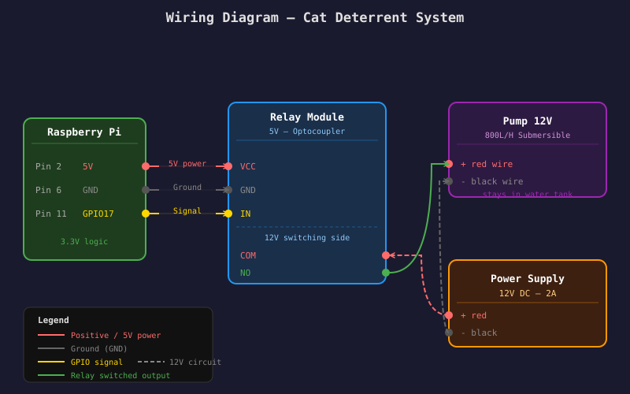
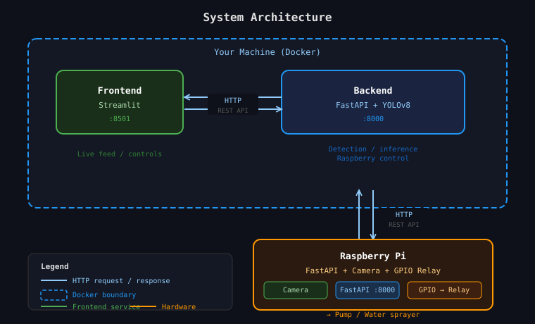
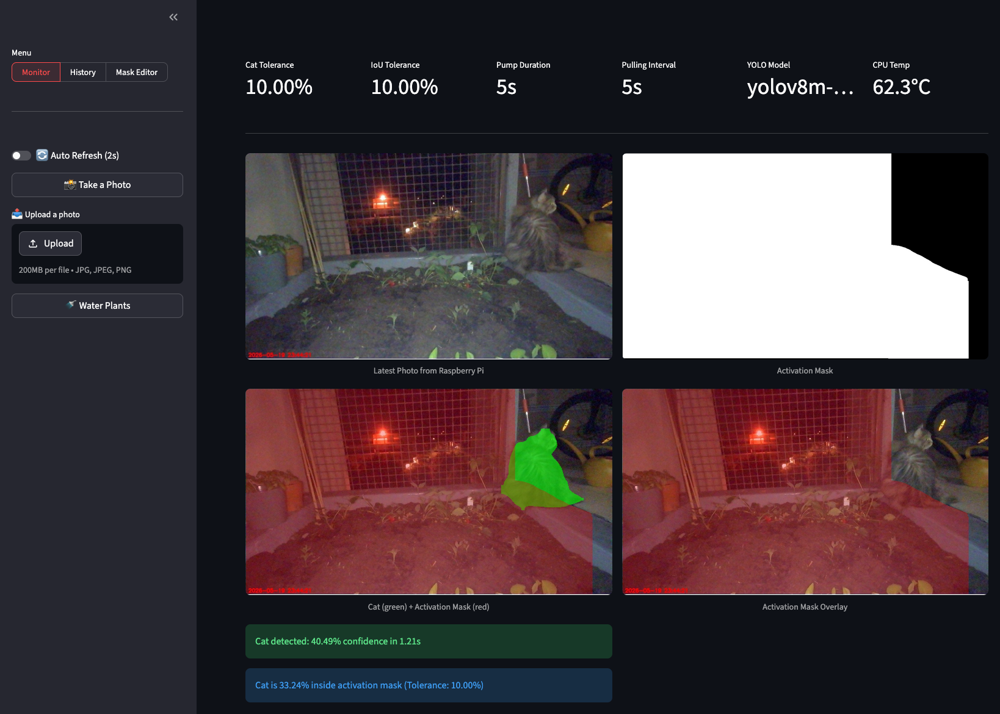
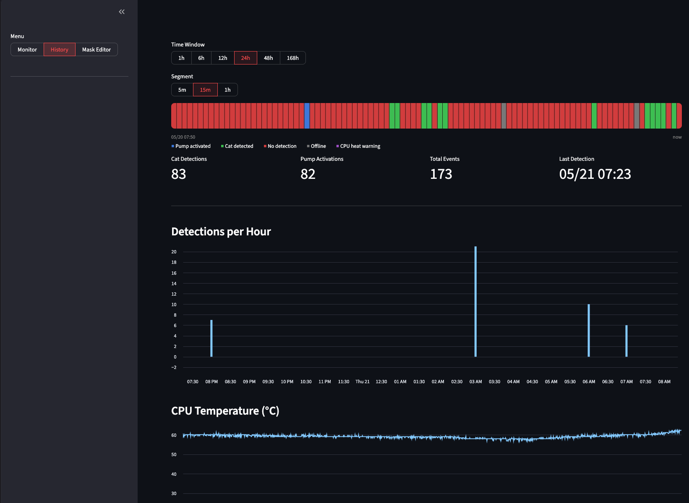
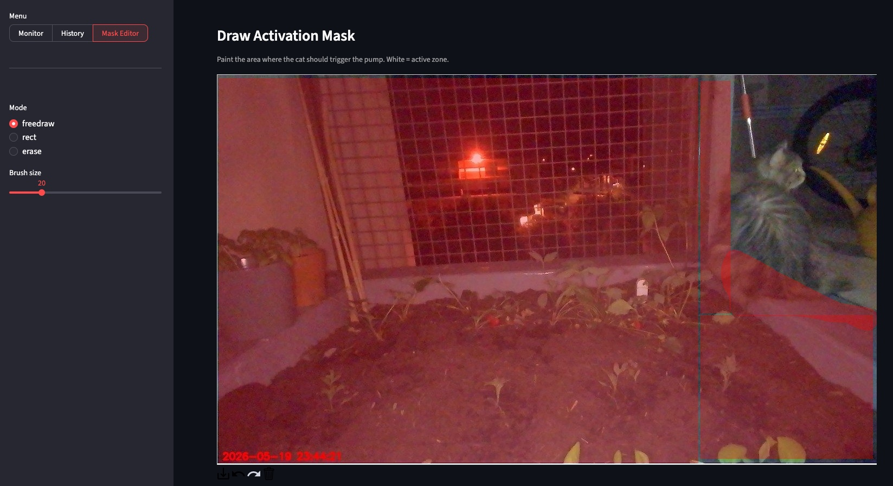

# WateringCat

My cat was destroying my new garden because it was sitting on the plants and sometimes digging the ground. So I wanted something to detect when it was in the garden and reppeal her (without stress).
I wasnt happy of available solutions:
- Motion detector water pump: Motion can be triggered by plant whit wind. Often the pump is to powerfull for my small garden.
- Motion detector ultrasound: Can produce stress, ultrasound can disturb animals of my neighbors.
- Fence: Need very high fence because cat can jump. Hide the garden, annoying to go through.
- Ground cat needle: Can hurt the cat, plants can stuck themself inside.

As an DevOPS and AI engineer I developped my own solution:  
An automated cat deterrent that uses computer vision to detect cats (avoid false positives of motion detector) and trigger a small water pump (less powerfull for my garden). A Raspberry Pi captures frames from a USB webcam, a backend server runs YOLOv8 detection, and a Streamlit dashboard lets you monitor and configure everything.

## Material

| Component | Link | Price |
|---|---|---|
| Irrigation Sprinkler | [AliExpress](https://fr.aliexpress.com/item/1005006097333617.html?gatewayAdapt=glo2fra) | 13,19 € |
| Power supply 12V | [Amazon](https://www.amazon.fr/dp/B07VCTTNWR) | 8.90 € |
| DC Connector | [Amazon](https://www.amazon.fr/dp/B06XPVJT1Z?th=1) | 7.99 € |
| Cables | [Amazon](https://www.amazon.fr/dp/B01JD5WCG2) | 9.99 € |
| Water bottle 10L | [Amazon](https://www.amazon.fr/dp/B003LSU6K2) | 10.99 € |
| Relay 5V | [Amazon](https://www.amazon.fr/dp/B0FCFKN772) | 7.99 € |
| Water Pump | [Amazon](https://www.amazon.fr/dp/B09SKSZY4Q) | 16.98 € |
| Raspberry Pi 3B+ | [Amazon](https://www.amazon.fr/-/en/Raspberry-Pi-3-Model-Motherboard/dp/B07BDR5PDW) | 57.80 € |
| USB Webcam (Ugreen) | [Amazon](https://www.amazon.fr/-/en/UGREEN-Rotation-Windows-Streaming-Conferencing/dp/B0C76ZD7KV) | 20.99 € |
Total (at 21/05/2026): 154,82 €

## Physical Wiring



The relay is wired to GPIO pin 17 (BCM). The pump is active-LOW: the relay is normally HIGH (pump off) and pulled LOW to fire.

## Software stack
1. The **Raspberry Pi** streams camera frames and controls a relay-driven water pump over a local HTTP API.
2. The **backend** polls the Pi at a configurable interval, runs YOLOv8 on each frame, and fires the pump when a cat is detected inside a user-defined activation zone.
3. The **frontend** (Streamlit) shows the live feed, detection overlays, event history, and a mask editor.



## Setup

### 1. Raspberry Pi

Install dependencies and start the Pi service with the provided scripts:

```bash
cd rasp
./uv_setup.sh   # install uv + dependencies
./uv_start.sh   # start the FastAPI server
```

The Pi exposes:
- `GET /shot` — latest JPEG frame (1280×720)
- `GET /pump/on?duration=<s>` — turn pump on, auto-off after `duration` seconds
- `GET /pump/off` — turn pump off
- `GET /temperature` — CPU temperature in °C

### 2. Backend + Frontend (Docker)

Copy the example env file and fill in your values:

```bash
cp .env.example .env
```

Then start both services:

```bash
docker compose up --build
```

The frontend is available at `http://localhost:<FRONTEND_PORT>`.

## Configuration

All backend settings are read from `/.env` (mounted into the container):

| Variable | Default | Description |
|---|---|---|
| `RASP_ADDRESS` | — | Hostname/IP of the Raspberry Pi (e.g. `192.168.1.42:8000`) |
| `YOLO_MODEL` | `yolov8m-seg.pt` | YOLOv8 model file to use |
| `DEFAULT_PULLING_INTERVAL` | `5` | Seconds between frames pulled from the Pi |
| `CAT_TOLERANCE` | `0.5` | Minimum YOLO confidence to count as a detection |
| `IOU_TOLERANCE` | `0.3` | Minimum fraction of cat mask inside activation zone to trigger pump |
| `PUMP_DURATION` | `5` | Seconds the pump runs per trigger |
| `DISCORD_WEBHOOK` | — | Discord webhook URL for notifications |
| `DISCORD_ALERT_WHEN_CAT` | `False` | Send a Discord alert (with photo) when cat triggers pump |
| `DISCORD_UNAVAILABLE_ALERT` | `False` | Send a Discord alert when the Pi goes down or comes back |
| `DISCORD_ALERT_CPU_TEMPERATURE` | `False` | Send a Discord alert when CPU temperature exceeds threshold |
| `CPU_TEMPERATURE_ALERT_LEVEL` | `80` | CPU temperature threshold in °C |
| `BACKEND_PORT` | — | Host port for the backend API |
| `FRONTEND_PORT` | — | Host port for the Streamlit frontend |

## Frontend tabs

### **Monitor**


Live camera feed with cat detection overlay, activation mask preview, and a manual pump trigger button. Supports auto-refresh every 2 seconds.

### **History**

Color-coded activity timeline plus per-event log. Shows cat detection counts, pump activations, and CPU temperature chart.
| Color | Meaning |
|---|---|
| Green | Cat detected |
| Blue | Pump activated |
| Red | No detection |
| Gray | Pi offline |
| Purple | CPU heat warning |

### **Mask Editor**

Draw the activation zone directly on the camera image using freehand, rectangle, or erase tools. Saved to `/app/config/activation_mask.png` on the backend.

## Project structure

```
WateringCat/
├── backend/          # FastAPI + YOLOv8 detection engine
│   ├── src/
│   │   ├── core.py   # Backend class, detection loop, Discord alerts
│   │   └── main.py   # FastAPI routes
│   └── config/
│       └── activation_mask.png
├── frontend/         # Streamlit dashboard
│   └── src/main.py
├── rasp/             # Raspberry Pi FastAPI server (camera + GPIO)
│   └── src/main.py
├── docs/
│   └── wiring_diagram.svg
└── docker-compose.yml
```
